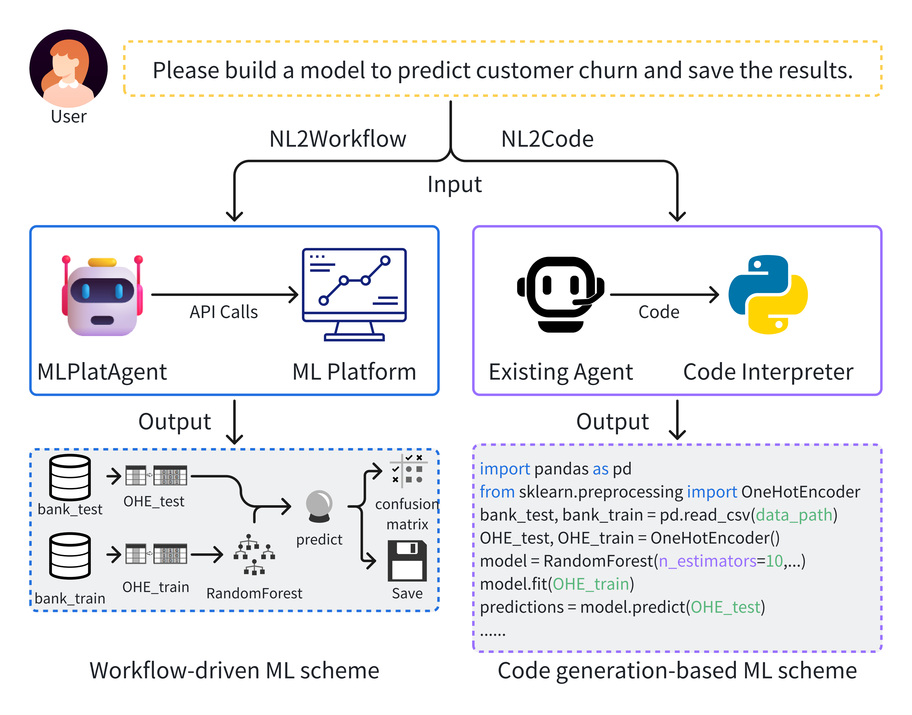

# MLPlatAgent 🤖🛠️

> **Collaborating with Specialized Software: A System-AI Collaborative Agent for Automated Machine Learning Workflow Construction**

[](https://opensource.org/licenses/MIT)
[](https://www.python.org/downloads/)
[]()

Welcome to the official repository for **MLPlatAgent**. 

We are exploring a novel `System-AI Collaborative` software engineering path. MLPlatAgent orchestrates professional low-code Machine Learning platforms via Large Language Models (LLMs), pioneering the transition from traditional code generation (NL2Code) to workflow orchestration (**NL2Workflow**).

---

## ✨ Core Features & Paradigm Shift

Unlike existing coding assistants (e.g., Claude Code) or agents evaluated on MLE-Bench that generate raw scripts from scratch, MLPlatAgent acts as an intelligent orchestrator over mature enterprise ML platforms.

* 🔄 **NL2Workflow Paradigm (System-AI Collaboration):** Shields the LLM from highly error-prone low-level syntax generation. By delegating execution to the native engines of low-code platforms, it actively avoids hallucinations and bugs.
* 🔗 **Function Call Code (FCC) Mechanism:** A novel architectural design that resolves Directed Acyclic Graph (DAG) dependency bottlenecks. It successfully passes intermediate states and variables between sequential node operations.
* 🧠 **Data-Aware Tool Selection:** Dynamically incorporates dataset summary profiles (e.g., target feature distributions) into the context, enabling the agent to proactively retrieve specialized tools (such as resampling widgets for highly imbalanced datasets).
* 🛡️ **Feedback-Driven Fault Tolerance:** Leverages the robust error-handling capabilities of industrial ML platforms, capturing native error logs to prompt the LLM for re-evaluation and self-correction during workflow generation.

---

### Comparison & Architecture

<p align="center">
  
  
</p>

MLPlatAgent processes unstructured natural language instructions and translates them into executable workflow topologies through three main phases:
1. **Intent Identification & Task Decomposition:** Routes intents into specialized paths (Traditional ML, Deep Learning, Modification) utilizing standardized heuristic mappings to align with enterprise low-code templates.
2. **Hierarchical Tool Retrieval:** Synergizes user queries with dynamic data summaries to retrieve the most context-appropriate platform widgets.
3. **Workflow Assembly via FCC:** Constructs the explicit DAG topology, ensuring logical soundness and executable structural adherence prior to deployment.

---

## 🌐 Methodological Transferability

While the current codebase implementation of MLPlatAgent is specifically tailored for the Uniplore platform, the core architectural designs of our framework are fundamentally platform-agnostic. The operation space defined in this framework (comprising universal actions such as adding/deleting nodes, configuring parameters, and establishing edge connections) is completely independent of any specific platform's underlying implementation.

To migrate MLPlatAgent to a new environment or an alternative low-code ML platform (such as KNIME or RapidMiner), developers only need to modify the platform-specific implementations under the `ml_platform/` directory. Specifically, by updating `actions.py`, you can easily map this unified operation space to the heterogeneous APIs of your target underlying platform. Through this straightforward wrapper layer adaptation and by updating the corresponding meta-descriptions in the tool library, MLPlatAgent can be seamlessly transferred to other mainstream workflows.

---

## 📁 Repository Structure

Below is an overview of the core file structure and components in this repository:

```text
MLPlatAgent/
├── agents/                  # Core agent modules
│   ├── data_loader.py       # Data analysis and tool profile loading
│   ├── executor.py          # Workflow assembly & FCC execution
│   ├── mlagent.py           # Main agent orchestrator entry
│   └── planner.py           # Intent identification & task decomposition
├── data/                    # Datasets, benchmarks, and platform examples
│   ├── benchmark/           # NL2Workflow evaluation datasets (e.g., UCI, Kaggle)
│   ├── cases_library/       # In-context learning examples for planner/executor
│   └── ml_platform_data_example/ # Platform widget and action configurations
├── embedding_models/        # Local embedding models directory
│   └── embedding_model.py   # Embedding utility script
├── llm/                     # LLM integration scripts (OpenAI, etc.)
│   └── llm.py
├── ml_platform/             # Low-code platform interaction interfaces
│   ├── actions.py           # Action execution mapping
│   └── ai_studio.py         # Platform specific integrations
├── prompts/                 # Prompt templates for the LLM agent
│   ├── data_loader_prompts.py
│   ├── executor_prompts.py
│   ├── planner_prompts.py
│   └── workflow_optimizer.py
├── static/                  # Images for README and documentation
├── utils/                   # Helper functions (logging, DB utilities, etc.)
├── config.py                # Global configuration settings
├── requirements.txt         # Python dependencies
└── run.py                   # Main entry point to run the agent

```

---

## 🚀 Quick Start

### Prerequisites

* Python 3.10 or higher
* Access Credentials for the Low-code ML Platform: Tailored for the Uniplore platform. You can register an account at the [Uniplore Lab Platform](https://lab.guilan.cn/#/login) to obtain authorization and experience the system directly.
* OpenAI API Key (or an equivalent LLM provider key)

### Installation

1. **Clone the repository and set up the environment:**
```bash
git clone [https://github.com/acmisxuyutian/MLPlatAgent.git](https://github.com/acmisxuyutian/MLPlatAgent.git)
cd MLPlatAgent

# Create and activate a conda environment
conda create -n mlagent python=3.11
conda activate mlagent

# Install required dependencies
pip install -r requirements.txt

# run 
python run.py
```


2. **Setup Embedding Models:**
Because MLPlatAgent utilizes dataset and example retrieval, you need a local embedding model.
* Download the [`multilingual-e5-large`](https://huggingface.co/intfloat/multilingual-e5-large) model from HuggingFace.
* Place the downloaded model files into the `embedding_models/` directory in this repository.


---

## 🎥 Video Demo

Check out our [demonstration](https://youtu.be/aN-5xPOluyU) of the framework in action, specifically integrating MLPlatAgent with the Uniplore ML platform

---
