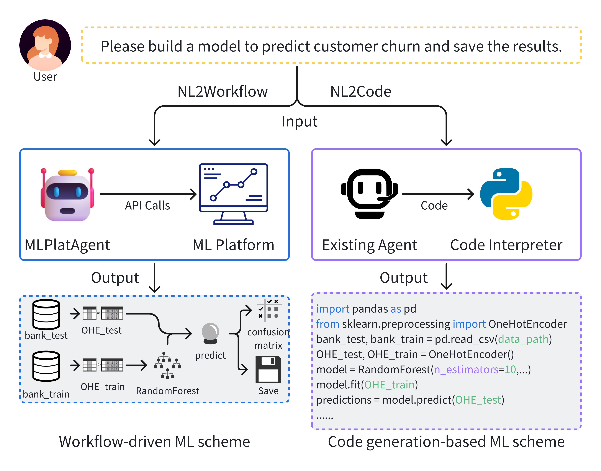

# MLPlatAgent

[中文](README_ZH.md)

> Collaborating with Specialized Software: A System-AI Collaborative Agent for Automated Machine Learning Workflow Construction

[](LICENSE)
[](https://www.python.org/downloads/)
[]()

MLPlatAgent is a system-AI collaborative agent that converts natural-language machine-learning requests into executable low-code ML platform workflows. Instead of generating a complete raw script, MLPlatAgent retrieves platform components, assembles a workflow DAG, and delegates workflow execution to the selected platform.

## Core Features

- **NL2Workflow paradigm:** translates user requirements into platform-native workflow operations rather than standalone scripts.
- **Function Call Code mechanism:** represents node creation, parameter updates, and DAG edge construction as executable function calls.
- **Data-aware tool selection:** uses dataset summaries and task context to retrieve relevant components and cases.
- **Feedback-driven repair:** uses platform execution feedback and error messages to revise generated workflows.
- **Unified platform Action:** keeps planning and workflow construction independent of platform-specific APIs and workflow formats.



## System Architecture

MLPlatAgent has three main stages:

1. **Intent identification and task decomposition:** classifies the request and decomposes it into workflow-level steps.
2. **Hierarchical tool retrieval:** combines user requirements, cases, platform components, and dataset summaries to select appropriate operations.
3. **Workflow assembly via function calls:** generates function-call code that adds nodes, updates parameters, and connects the workflow DAG.

The Agent core imports one process-wide platform adapter:

```python
from ml_platform.actions import action_agent
```

`action_agent` is instantiated from the platform selected in the root `config.py`.


## Supported Platforms

| Platform | Workflow target | Data source used by SQL Table | Runtime | Platform configuration |
| --- | --- | --- | --- | --- |
| **Uniplore** | Remote workflow operated through the platform API | MySQL | Project Conda or Python environment | `UNIPLORE_CONFIG` |
| **Orange3** | Local `.ows` workflow | PostgreSQL | Portable Orange Python | `ORANGE3_CONFIG` |

The two platforms share the same Planner, Executor, prompts, cases, and root `run.py` entry point. Their platform boundaries are different:

- Uniplore requires an access token, a remote workflow ID, and an API URL.
- Orange3 requires only the path of the current `.ows` workflow as its platform configuration. It does not use or validate Uniplore credentials.
- MySQL and PostgreSQL settings are data-source configurations, not platform identity settings.
- Platform selection is read once during Python process initialization. Restart the process after changing `PLATFORM` or its configuration.

For details about adding another platform, see [the platform extension guide](ml_platform/README.md).

## Repository Contents

| Path | Contents |
| --- | --- |
| `agents/`, `ml_platform/`, `prompts/`, `llm/`, `utils/` | MLPlatAgent implementation. |
| `data/benchmark/ml_benchmark.json` | ML-Benchmark instruction and evaluation file; 8 released instructions. |
| `data/benchmark/dseval_kaggle.json` | DSEval-Kaggle instruction and evaluation file; 10 released instructions. |
| `data/benchmark/DSEval-Kaggle-Ext/UCI.json` | Unclear Instructions in DSEval-Kaggle-Ext; 14 released instructions. |
| `data/benchmark/DSEval-Kaggle-Ext/CI.json` | Clear Instructions in DSEval-Kaggle-Ext; 14 released instructions. |
| `data/benchmark/DSEval-Kaggle-Ext/MI.json` | Modification Instructions in DSEval-Kaggle-Ext; 21 released instructions. |
| `data/benchmark/datasets/ml_benchmark.sql` | SQL dump for ML-Benchmark datasets. |
| `data/benchmark/datasets/dseval_kaggle.sql` | SQL dump for DSEval-Kaggle datasets. |
| `data/benchmark/datasets/mlagent.sql` | SQL dump for the extended MLPlatAgent datasets. |
| `data/ml_platform_data_example/` | Example platform component metadata. |
| `data/cases_library/` | Case libraries used during Planner and Executor retrieval. |
| `RCR Checklist.pdf` | Requirement checklist used in the experiments. |

The benchmark JSON entries contain an `Instruction` field and a `requirements` object. The requirements record the expected workflow nodes, parameters, and DAG dependencies through `step_requirements` and `dependency_requirements`.

## Prerequisites

Shared requirements:

- an OpenAI-compatible chat-completion endpoint and API key;
- the embedding model used by the retriever;
- access to the database required by the selected task;
- Windows when using the documented Portable Orange runtime and commands.

The experiments used:

- Python 3.10 or later; Python 3.11 is recommended for the Uniplore environment;
- `openai==0.27.0`;
- `Qwen2.5-72B-Instruct` and `Qwen2.5-14B-Coder` as the Agent backbone models;
- `multilingual-e5-large` as the default retriever;
- `temperature=0`, `top_p=1`, and `max_tokens=4096` in `llm/llm.py`;
- `RANDOM_SEED = 42` in `config.py`.

Private platform credentials, LLM API keys, downloaded embedding weights, and execution logs are not included in the repository.

## Installation

Clone the repository first:

```bash
git clone https://github.com/acmisxuyutian/MLPlatAgent.git
cd MLPlatAgent
```

Then prepare the runtime for the platform you intend to use.

### Option A: Uniplore

Create a standard Python environment and install the root dependencies:

```bash
conda create -n mlagent python=3.11
conda activate mlagent
pip install -r requirements.txt
```

This environment is used to start MLPlatAgent. The Uniplore workflow itself is executed remotely through the configured platform API.

### Option B: Orange3

MLPlatAgent uses the Windows Portable Orange distribution. Do not use a Conda or system-wide Orange installation for this startup path.

1. Open the [official Orange download page](https://orangedatamining.com/download/).
2. Under **Windows**, download **Portable Orange** (`Orange3-3.40.0.zip`).
3. Extract the archive into `ml_platform/orange3/` in this project.
4. Confirm that the interpreter is available at:

```text
ml_platform/orange3/Orange3-3.40.0/Orange/python.exe
```

The expected directory structure is:

```text
ml_platform/
└── orange3/
    └── Orange3-3.40.0/
        └── Orange/
            ├── python.exe
            └── pythonw.exe
```

From the project root, install the dependencies from the root `requirements.txt` into Portable Orange:

```powershell
.\ml_platform\orange3\Orange3-3.40.0\Orange\python.exe `
  -m pip install -r .\requirements.txt
```

The same interpreter must be used later to start the root `run.py`.

### Embedding Model

Download the embedding model before running component and case retrieval:

```bash
mkdir -p embedding_models
# Download the model from Hugging Face and place it at:
# embedding_models/multilingual-e5-large
```

Default model: [`intfloat/multilingual-e5-large`](https://huggingface.co/intfloat/multilingual-e5-large).

If another retriever supported by `embedding_models/embedding_model.py` is used, place it under `embedding_models/<retriever-name>`.

## Configuration

All user configuration belongs in the root `config.py`. MLPlatAgent does not use command-line parameters to select a platform or supply credentials.

### Shared Configuration

Select the platform and configure the LLM:

```python
PLATFORM = "uniplore"  # or "orange3"

Model_PATH = "<openai-compatible-base-url>"
MODEL_NAME = "<chat-model-name>"
API_KEY = "<llm-api-key>"
RANDOM_SEED = 42
```

For experiment reproduction, deploy the open-source [`Qwen2.5-72B-Instruct`](https://huggingface.co/Qwen/Qwen2.5-72B-Instruct) or the required backbone model behind an OpenAI-compatible endpoint. For functional testing, another compatible LLM can be configured through the same fields.

### Uniplore Configuration

Set `PLATFORM = "uniplore"`, then configure the remote workflow and MySQL data source:

```python
UNIPLORE_CONFIG = {
    "access_token": "<platform-access-token>",
    "workflow_id": <platform-workflow-id>,
    "api_url": "<platform-api-base-url>",
}

MySQL_Config = {
    "server": "<host reachable by Uniplore>",
    "port": "3306",
    "username": "<mysql-user>",
    "password": "<mysql-password>",
    "database": "mlagent",
}
```

The token must be allowed to modify and execute the configured workflow. The MySQL database must be reachable by both MLPlatAgent and the Uniplore service.

If benchmark tables are required, create a database and import the released MySQL dumps as needed:

```bash
mysql -u <user> -p -e "CREATE DATABASE IF NOT EXISTS mlagent DEFAULT CHARACTER SET utf8mb4;"
mysql -u <user> -p mlagent < data/benchmark/datasets/ml_benchmark.sql
mysql -u <user> -p mlagent < data/benchmark/datasets/dseval_kaggle.sql
mysql -u <user> -p mlagent < data/benchmark/datasets/mlagent.sql
```

### Orange3 Configuration

Set `PLATFORM = "orange3"`, then configure the local workflow path and PostgreSQL data source:

```python
ORANGE3_CONFIG = {
    "workflow_path": r"D:\workflows\current.ows",
}

PG_CONFIG = {
    "host": "localhost",
    "port": "5432",
    "database": "mlagent",
    "schema": "public",
    "user": "postgres",
    "password": "<postgres-password>",
}
```

`workflow_path` must end in `.ows`. The parent directory and an empty workflow are created when necessary. Orange3 does not read or validate `UNIPLORE_CONFIG`. `PG_CONFIG` is required only when the workflow uses SQL Table; sample datasets can be used without a database connection.

## Running MLPlatAgent

The root `run.py` is the only formal project entry point. Edit the `requirement` string in that file, configure the selected platform in `config.py`, and use the corresponding command below.

### Start with Uniplore

```powershell
python .\run.py
```

### Start with Orange3

```powershell
.\ml_platform\orange3\Orange3-3.40.0\Orange\python.exe .\run.py
```

Orange3 persists the generated workflow to the `.ows` file configured in `ORANGE3_CONFIG["workflow_path"]`. After the task finishes, open this file with Orange Canvas to inspect the workflow nodes, parameters, and connections. [Watch the Orange3 workflow viewing demo](static/orange3_demo.mp4) to see how to open and view the generated `.ows` workflow.

Do not start the Orange3 path with the Conda or system Python interpreter. After changing `PLATFORM`, terminate the current process and start `run.py` again.

The default request in `run.py` constructs a model for bank customer churn prediction. The script prints the Agent result as JSON. A short demo video is available at <https://youtu.be/aN-5xPOluyU>.

## License

This project is released under the MIT License. See [LICENSE](LICENSE).
